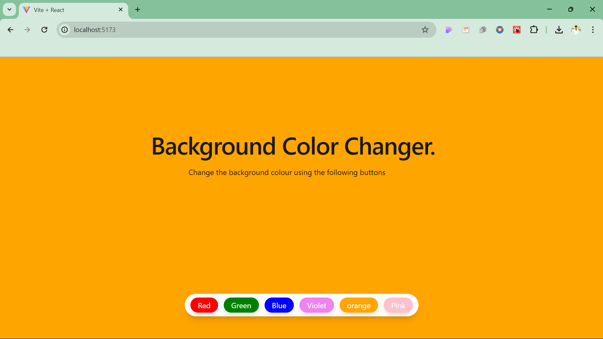
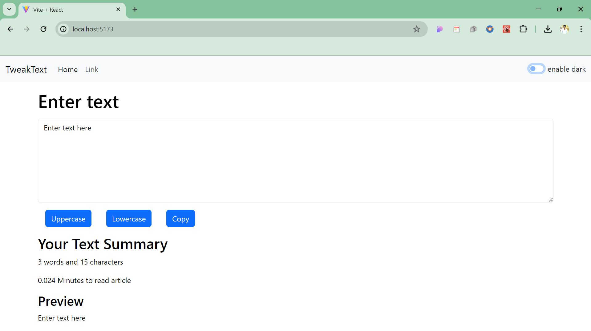
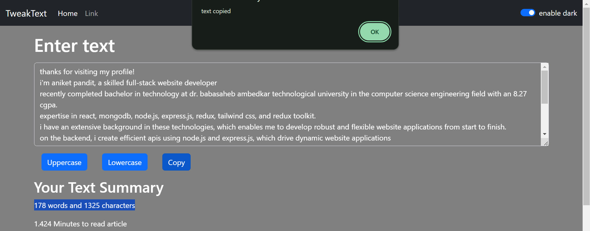
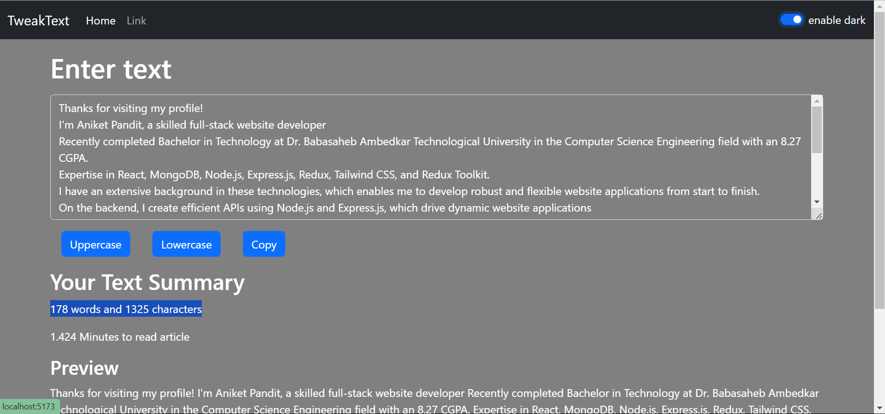
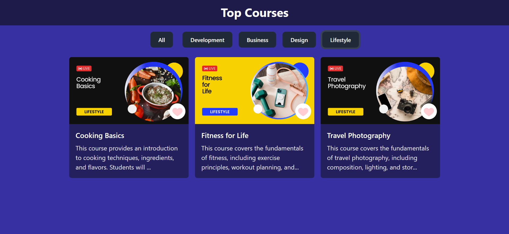

# Learn react with me
### this repository contain react code and notes

<!-- bg changer-->
=======
#### React Learning Project01
## Background Colour Changer

<!-- tweak text -->
#### React Learning Project02
## Text Utility (TweakText)

<!-- Top courses-->
#### React Learning Project03
## Background Colour Changer

