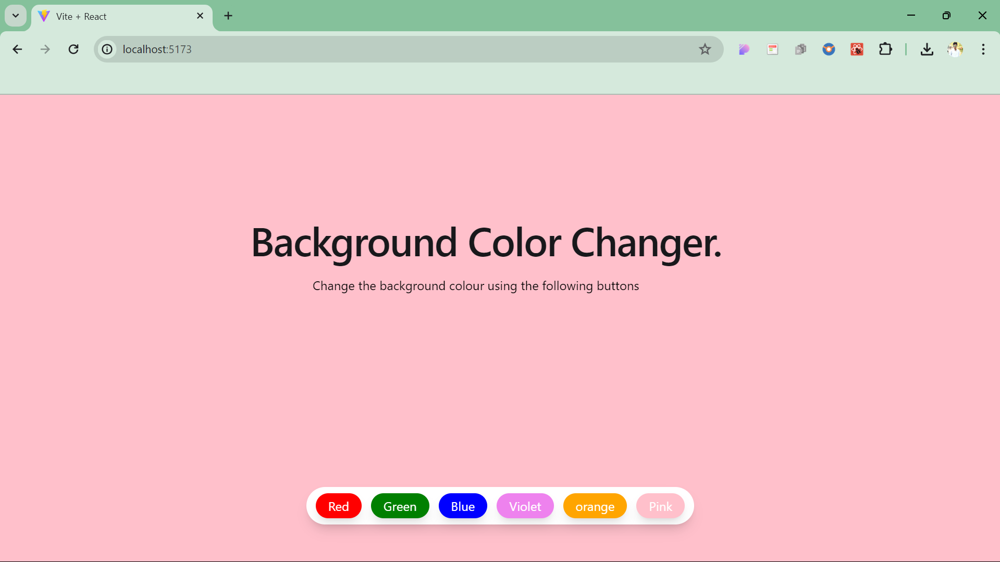

# Learn react with me

### This repository contains a collection of React.js projects that I have developed. Each project showcases different aspects of front-end development using React, from component-based architecture to state management, routing, and integration with APIs. The projects vary in complexity, allowing you to explore different skills and techniques.

---

## Table of Contents

1. [Project 1: Background Colour Changer](#project-1-background-colour-changer)
2. [Project 2: Text Utility- Tweak Text](#project-2-text-utility-tweak-text)
3. [Project 3: Top Courses](#project-3-top-courses)

---

<!-- Top courses-->
## Project 0: Counter App

---

 <!-- bg changer-->
## Project 1: Background Colour Changer

### Description:
This full-stack e-commerce application is built using React.js on the front end, with state management using React Context API. The app allows users to browse products, add them to the cart, and make a purchase. It integrates with a backend API to fetch product details and handles user authentication.

### Features:
- Product listing and filtering
- Shopping cart functionality
- User authentication (login/logout)
- Responsive design

### Technologies:
- React.js

### Screenshot:

---

<!-- Password Generator  -->
## Project 2: Password Generator

---
<!-- tweak text -->
## Project 3: Text Utility (Tweak Text)

---

<!-- Top courses-->
## Project 3: Top Courses

---

<!-- Blog App-->
## Project 3: Blog App

---
<!-- Docs App-->
## Project 3: Docs App

---
---
<!-- Form App-->
## Project 3: Form App

---
---
<!-- GIF Generator-->
## Project 3: GIF Generator

---
---
<!-- Plan with Love-->
## Project 3: Plan with love

---
<!-- React Portfolio-->
## Project 3: React Portfolio

---
<!-- Testimonials App-->
## Project 3: Testimonials App

---